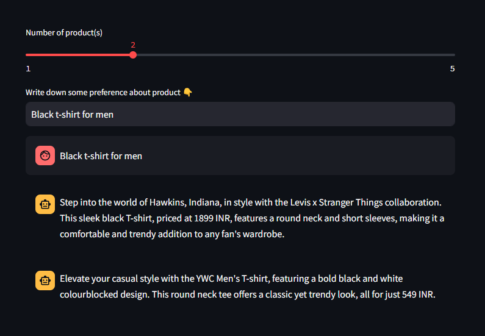

# Product Recommendation System



## Dataset

This system uses the dataset from [kaggle](https://www.kaggle.com/datasets/shivamb/fashion-clothing-products-catalog).

**About this Dataset**: Fashion Clothing Product Catalog from Myntra.com.

Myntra is a major Indian fashion e-commerce company headquartered in Bengaluru, Karnataka, India. The company was founded in 2007 to sell personalized gift items. In May 2014, Myntra.com was acquired by Flipkart.

**Attributes**: ProductID, ProductName, ProductBrand, Gender, Price (INR), NumImages, Description, PrimaryColor.

## Embedding Model

The model I have utilized is [all-MiniLM-L6-v2](https://huggingface.co/sentence-transformers/all-MiniLM-L6-v2)

This is a sentence-transformers model: It maps sentences & paragraphs to a 384 dimensional dense vector space and can be used for tasks like clustering or semantic search.

In this system, I select these attributes for embeddings:
`ProductBrand`, `Gender`, `Description`, `PrimaryColor`.

## How it works

First, I need to preprocess the data and combine the potential attributes into a singular sentence.

Next, I load the data from `.csv` file then load it to Chromadb.

I use similarity search to find the `k` most relevent products from user input.

Finally, I inform Cohere Chatbot to write some brief introduction about these products after passing the product information to it.

## How-to use
- Create `.env` file. In `.env` file, write down `COHERE_API_KEY=YOUR_COHERE_API`. Replace your Cohere API key here.
- Install the libraries:
```bash
pip install -r requirements.txt
```
- To run the system, type:
```bash
python main.py
```
- Finally, please enter your query, and the recommendation system will generate a list of the top `k` products that most closely match your specifications.
